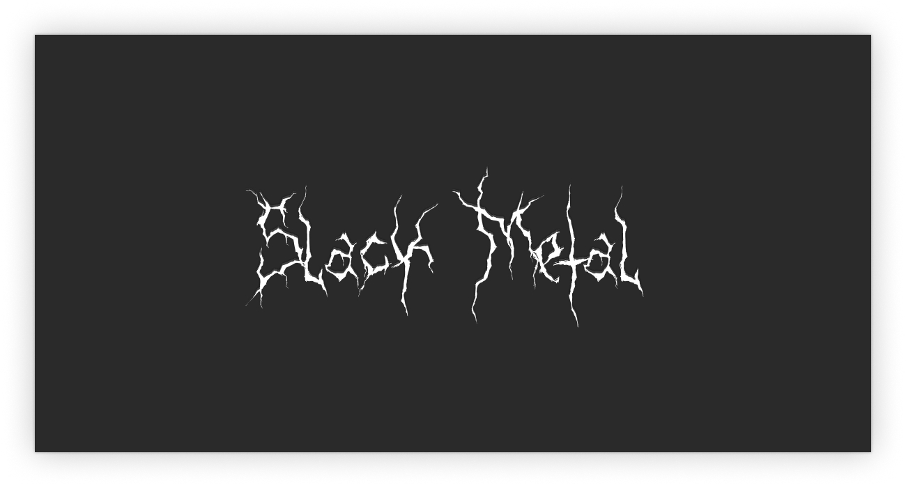

Slack Metal – A Dark Theme for Slack
====================================



## About
Slack Metal is a dark theme for the Slack Mac app. It is designed to put less strain on your eyes and to blend in seamlessly with the macOS Dark Mode. 

This project was born from a method provided by @laCour (https://github.com/laCour/slack-night-mode/issues/73#issuecomment-287467332)

## Disclaimer
This is a hack – use it at your own peril! Also, the CSS-file is a beautiful mess...

## Instructions 
* Install the sidebar theme on Slack > Settings > Sidebar > Theme:
```style
#2e272c,#3E313C,#4a4a4a,#FFFFFF,#3E313C,#FFFFFF,#a627d9,#b5313e
```
* Run the script named `slack_metal.sh`. 
* Reload Slack.
* If necessary, enable dev tools on Slack via Terminal:
```shell
export SLACK_DEVELOPER_MENU=true
```
```shell
open -a /Applications/Slack.app
```
